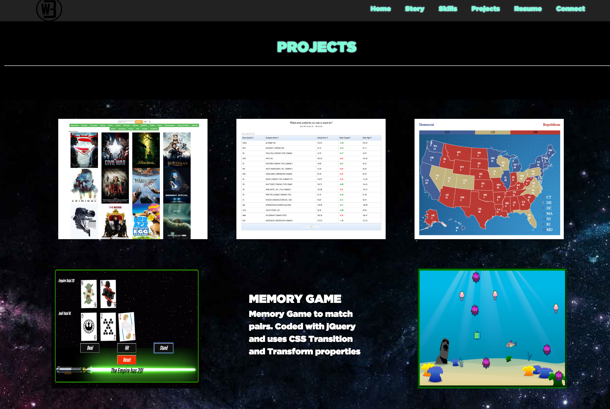

# Copy of Portfolio repository pushed to Github from NEW client computer.
### Didn't hvae PEM keys for AWS so just started over from Scractch
### USing this copy to add Google Analytics and Google DTM

# Building a Portfolio Website with HTML, CSS, jQuery
### Thanks for stalking My Super Awesome Site/Readme.md/GitHub Profile!
### Using Github as project base for commiting to Ubuntu AWS Server

<!---->
###Created Layout With BootStrap 
#####Home, Story, Deep Thoughts, Projects, and Connect Sections
#####Added Black Headers Before Each Section
###Styled Each Section using SCSS/CSS
#####Implemented sweet page-load sequence using CSS animations
#####Implemented wow animations on content of individual sections
###Updated Projects Sections
#####Added projects with links and css hover animations into Projects section
###Implemented php mailer in AWS
#####In connect section used a Php Mailer.
#####Dowloaded php mailer inside Ubuntu AWS server
###Deployed Project To AWS
